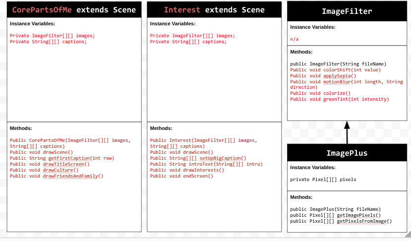

# personalnarrativeproject
# Unit 5 - Personal Narrative / Interest Animation

## Introduction

Images are often used to portray our personal experiences and interests. We also use image filters and effects to change or enhance the mood of an image. When combined into collages and presentations, these images tell a story about who we are and what is important to us. Your goal is to create an animation using The Theater and Scene API that consists of images of your personal experiences and/or interests. In this animation, you will incorporate data related to these experiences and/or interests that can be organized in a 2D array, and use image filters and effects to change or enhance the mood of your images.
## Requirements

Use your knowledge of object-oriented programming, two-dimensional (2D) arrays, and algorithms to create your personal narrative collage or animation:
- **Write Scene subclasses** – Create two Scene subclasses: either two core parts of your personal life, or two components of a personal interest. Each class must contain a constructor and private instance variable with data related to the scene
- **Create at least two 2D arrays** – Create at least two 2D arrays to store the data that will make up your visualization.
Implement algorithms – Implement one or more algorithms that use loops and logic that operate on the data in your 2D arrays.
- **Create a visualization** – Create an animation that conveys the story of the data by illustrating the patterns or relationships in the data.
- **Image Filters** – Utilize the image filters created in this unit (and possible new filters) that show a personal flare to the images used in your animation.
- **Document your code** – Use comments to explain the purpose of the methods and code segments and note any preconditions and postconditions.

## UML Diagram

## Video

<video controls src="Screen recording 2026-02-10 9.28.41 PM.webm" title="Title"></video>

## Story Description

The story that my animation showcases includes my heritage and a basic fun fact about it. It also includes people that are very important to me including my sister and my close friends. Lastly, I included some of my interests including my favorite book series and my favorite sport. The data in my project is represented in 2D arrays by the images and corresponding captions that are stored in two separate ones, and are called on in a corresponding manner to display a caption with each of the images on the screen.

## Image Filter Analysis

1. Green Tint Filter
The green tint filter modifies the green part of the RGB (red green blue) value of each pixel. It does this by adding a designated value (which is a parameter of the method) to the green value of each pixel so that the overall image appears more green. The intensity of the filter depends on the number inputted as the parameter.

2. Motion Blur Filter
The motion blur filter modifies the pixels by finding the neighboring pixels by iterating through them and finding the average RGB values to assigned to the pixel next to it. This is what gives it the blur effect. The blur effect can be either horizontal or vertical depending on the inputted value into the provided parameter. There is a second parameter, length, which just makes sure that the blurring and iterating process doesn't go farther than the number of pixels in the image.
